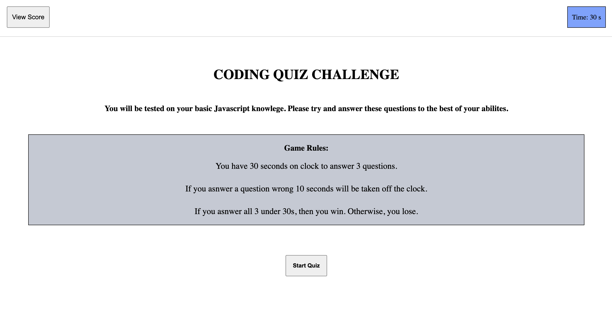

# Code-Quiz
homework-4

🦾 ABOUT THIS PROJECT

This is a quiz to test you on your Javascript knowlege. Made from HTML, CSS and Javascript.

🖥 HOW TO USE

All you need to have prior to taking this quiz is your basic knowlege of Javascript. These questions are not designed to trick you in any way. 

‼️ Please note. If you get a question wrong, time will be subtracted from your clock. So, answer deligently. (It's actually not that serious.)

Once you are done, write your initials and keep track of your own score.

🐱 GitHub Links

Repository: https://github.com/vynguyen205/Code-Quiz

Deployed: https://vynguyen205.github.io/Code-Quiz/

🔍 Notes + Articles

This was a hard project. It took me longer to get this one done the previous ones. 

Here are some articles that help:

    - Basics for localStorage
    
    https://www.section.io/engineering-education/how-to-use-localstorage-with-javascript/

    https://www.youtube.com/watch?v=k8yJCeuP6I8

    - To sort the scores 

    https://www.w3schools.com/jsref/jsref_sort.asp

    - Basics for JSON.parse

    https://stackoverflow.com/questions/4935632/parse-json-in-javascript

